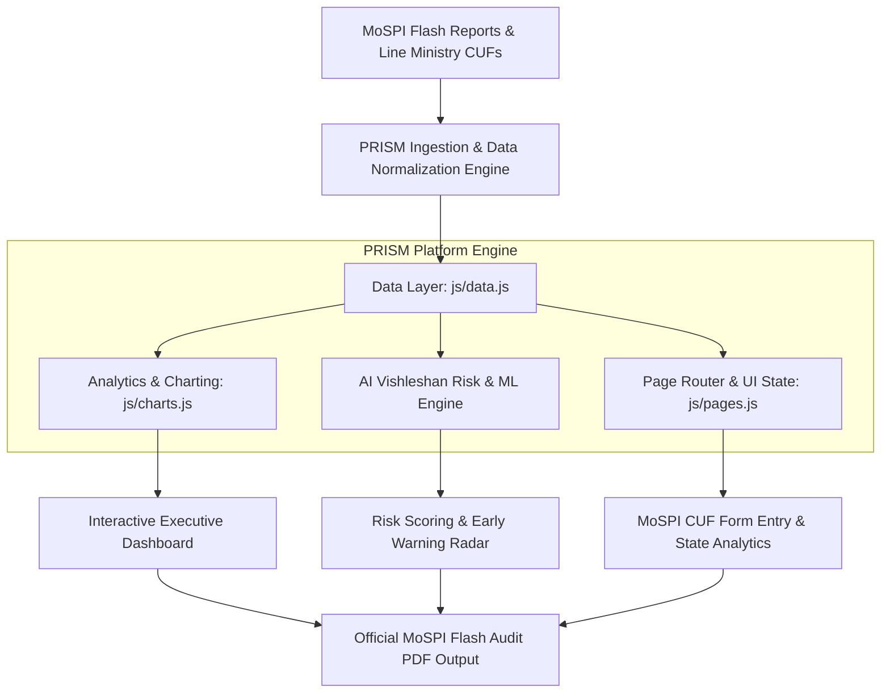

<div align="center">

# 🌐 PRISM — Unified Infrastructure Monitoring Platform
### *MoSPI Common Upload Form (CUF) & AI-Powered Vishleshan Engine*

[](https://www.mospi.gov.in)
[](https://github.com/Dinesh-design786/PRISM)
[](https://github.com/Dinesh-design786/PRISM)
[](https://github.com/Dinesh-design786/PRISM)

*Transforming Central Sector Infrastructure Management with Machine Learning, Multi-Month MoSPI Flash Report Integration, and Standardized Common Upload Forms (Annexures I–V).*

---

</div>

## 📌 Table of Contents
- [📖 Executive Overview](#-executive-overview)
- [🚨 The Problem & PRISM Solution](#-the-problem--prism-solution)
- [🛠️ Technology Stack Breakdown](#️-technology-stack-breakdown)
- [📊 Datasets & Monitored Footprint](#-datasets--monitored-footprint)
- [⚡ Key Modules & Platform Features](#-key-modules--platform-features)
- [🏗️ System Architecture](#️-system-architecture)
- [📁 Repository Structure](#-repository-structure)
- [🚀 Quickstart: How to Clone & Run Locally](#-quickstart-how-to-clone--run-locally)
- [🌐 Enterprise & Intranet Deployment Guide](#-enterprise--intranet-deployment-guide)
- [⌨️ Efficiency Command Palette & Shortcuts](#️-efficiency-command-palette--shortcuts)
- [🤝 Contributing & License](#-contributing--license)

---

## 📖 Executive Overview

**PRISM (Project Information System for Modernization & Vishleshan)** is an enterprise-grade AI analytics and project expenditure tracking platform designed for the **Infrastructure and Project Monitoring Division (IPMD)** of the **Ministry of Statistics and Programme Implementation (MoSPI), Government of India**.

PRISM automates project oversight across **2,048 central sector infrastructure projects** worth over **₹44.10 Lakh Crore**. It incorporates the **MoSPI Common Upload Form (CUF)** guidelines (Annexure I through V) to eliminate reporting friction across line ministries, predict cost/schedule overruns, and generate real-time actionable intelligence for policy makers.

---

## 🚨 The Problem & PRISM Solution

| Challenge in Legacy Monitoring | The PRISM Solution |
| :--- | :--- |
| **Fragmented Data** across multiple line ministries (Railways, NHAI, Power, Petroleum, Telecom) | **Unified Common Upload Form (CUF)** standardizing Annexure I–V project logging. |
| **Delayed Overrun Warnings** discovered after budget exhaustions | **AI Early Warning Radar & Risk Scoring** predicting delay likelihood months in advance. |
| **Static Monthly PDF Reports** requiring manual aggregation | **Interactive Real-Time Dashboard** powered by April, May, and June 2026 MoSPI Flash Datasets. |
| **Opaque State/UT Tracking** making localized bottlenecks hard to identify | **36 States & UTs Geo-Spatial Analytics** mapping expenditure and delay heatmaps. |

---

## 🛠️ Technology Stack Breakdown

PRISM is built with a state-of-the-art **Vanilla Web Engine architecture** designed for high performance, instant page loads, offline resiliency, zero security vulnerabilities from third-party build packages (`node_modules`), and seamless deployment on secure government intranet networks.

| Category | Technology / Library | Purpose & Implementation |
| :--- | :--- | :--- |
| **Markup & Structure** | **HTML5 (Semantic)** | Accessible, WAI-ARIA compliant layout with custom command palette modal, government header topbar, and reactive page container. |
| **UI Design System** | **Vanilla CSS3** | High-fidelity dark/light mode engine, custom CSS variables (`--bg-primary`, `--accent-blue`), glassmorphism, responsive grid/flexbox layouts, and custom keyframe animations. |
| **Core Client Engine** | **Vanilla JavaScript (ES6+)** | Modular architecture (`app.js`, `pages.js`, `charts.js`, `data.js`) handling dynamic client-side routing, toast alerts, state management, and user interactions with **Zero Build Overhead**. |
| **Analytics & Data Viz** | **Chart.js v4.4.0** | High-performance interactive visual charts (Doughnut charts, Multi-axis Line trends, Bar comparisons, and State performance metrics). |
| **Typography** | **Google Fonts** | `Inter` (UI elements & metrics), `Outfit` (Headings & Government Titles), and `JetBrains Mono` (Data badges & Project IDs). |
| **Data Engine** | **Normalized In-Memory JSON** | Ingested April, May, and June 2026 MoSPI Flash Datasets with live project filtering, state aggregation, and local storage persistence. |
| **Print & Audit Engine** | **Native Browser Print API** | Clean, formatted CSS `@media print` rules for generating official PDF Flash Audit Reports without third-party PDF generators. |
| **Deployment** | **Static Web Architecture** | Compatible with GitHub Pages, Vercel, Netlify, Apache, Nginx, and IIS intranet web servers. |

---

## 📊 Datasets & Monitored Footprint

PRISM ingests, validates, and visualizes comprehensive multi-month infrastructure data derived from official MoSPI IPMD Flash Reports:

```
├── 💰 Total Monitored Outlay   : ₹44.10 Lakh Crore
├── 📁 Total Monitored Projects : 2,048 Mega & Major Infrastructure Projects
├── 🏛️ Key Line Ministries      : 16+ Ministries (Railways, Road Transport & Highways, Power, Coal, Petroleum, Telecom, etc.)
├── 🗺️ Geographical Coverage    : All 36 States & Union Territories of India
└── 📄 Ingested MoSPI Datasets   :
     ├── MoSPI IPMD Concept Note (Standardization Guidelines dated 4 Sept 2024)
     ├── Flash Report April 2026 Dataset
     ├── Flash Report May 2026 Dataset
     └── Flash Report June 2026 Dataset (Latest Baseline)
```

---

## ⚡ Key Modules & Platform Features

### 1. 📊 Executive Multi-Month Dashboard
- Real-time KPIs tracking Total Portfolio Outlay, Cumulative Expenditure, Average Delay, and Critical Risk Flags.
- Interactive sector allocation breakdown and multi-month expenditure progression trends.

### 2. 📝 MoSPI Common Upload Form (CUF Integration)
- Standardized multi-step project logging engine supporting **Annexures I & II** (Project Demographics & Expenditure Logging) and **Annexures IV & V** (Milestone-based Delay Diagnostics & Escalation Factors).
- Automated milestone tracking with dynamic variance calculations.

### 3. 🗺️ State-Wise & UT Analytics
- Granular breakdown of project density, outlay, spent capital, and time delays across all **36 Indian States and Union Territories**.
- State comparison tables with sorting by risk, delay, and capital deployment.

### 4. 🧠 AI Risk Engine & Early Warning Radar
- Machine learning risk matrix scoring projects based on historical delay drivers, environmental clearance bottlenecks, land acquisition hold-ups, and contractor milestone defaults.
- Early warning alerts flagged as `CRITICAL`, `HIGH`, `MEDIUM`, or `LOW`.

### 5. 💬 AI Vishleshan Assistant (Interactive LLM Engine)
- Context-aware natural language query interface for querying project details, ministry performance summaries, and predictive forecast queries directly.

### 6. 🖨️ Official MoSPI Flash Audit Report Generator
- One-click print-ready PDF generator formatted to government audit standards for Cabinet Secretariat and Ministry reviews.

---

## 🏗️ System Architecture



---

## 📁 Repository Structure

```
d:/projects/sih/
├── 📄 index.html                       # Main Application Shell & Structure
├── 📄 README.md                        # Platform Documentation
├── 📁 css/
│   └── 🎨 style.css                    # Modern CSS Design Tokens & Layout Utilities
├── 📁 js/
│   ├── ⚙️ app.js                       # Application Entry Point & Event Handlers
│   ├── 📊 charts.js                    # Chart.js Visualizations & Graphical Engines
│   ├── 💾 data.js                      # Ingested MoSPI Datasets & State Engine
│   └── 📑 pages.js                     # Dynamic Page Renderer & UI Views
└── 📁 Ingested Documents/
    ├── 📕 Concept note to Line Ministries dated 4 Sept 2024 (2).pdf
    ├── 📕 FlashReport_April2026.pdf
    ├── 📕 FlashReport_May2026.pdf
    └── 📕 FlashReport_June_2026.pdf
```

---

## 🚀 Quickstart: How to Clone & Run Locally

PRISM is engineered with a **zero-dependency, lightweight, high-performance architecture**. You can run it instantly in any modern web browser without needing heavy build tools (No `node_modules` required!).

### Step 1: Clone the Repository
Open your terminal/command prompt and run:
```bash
git clone https://github.com/Dinesh-design786/PRISM.git
cd PRISM
```

### Step 2: Launch the Platform

#### Option A: Direct Open in Browser (Easiest)
Simply double-click `index.html` or open it directly in Chrome, Edge, Firefox, or Safari:
```bash
# Windows PowerShell
start index.html

# macOS
open index.html

# Linux
xdg-open index.html
```

#### Option B: Using VS Code Live Server
1. Open the cloned folder in **VS Code**.
2. Install the **Live Server** extension (if not already installed).
3. Right-click `index.html` and select **"Open with Live Server"**.

#### Option C: Simple Python HTTP Server
```bash
# Python 3
python -m http.server 8000
```
Then navigate to `http://localhost:8000` in your web browser.

---

## 🌐 Enterprise & Intranet Deployment Guide

PRISM can be deployed to public servers or private government intranet networks effortlessly.

### 1. GitHub Pages (Public / Staging)
1. Go to your repository settings on GitHub: `https://github.com/Dinesh-design786/PRISM/settings/pages`.
2. Under **Build and deployment** -> **Source**, select `Deploy from a branch`.
3. Choose branch `main` and root `/`, then click **Save**.
4. Your site will be live at `https://Dinesh-design786.github.io/PRISM/` in under 60 seconds!

### 2. Vercel Deployment
```bash
npm i -g vercel
vercel --prod
```

### 3. Government Intranet (IIS / Nginx / Apache Deployment)
Since PRISM consists of standard web assets (`index.html`, CSS, JavaScript), simply copy the project root directory into your web server's static hosting directory:
- **Nginx**: `/usr/share/nginx/html/prism`
- **Apache**: `/var/www/html/prism`
- **Windows IIS**: `C:\inetpub\wwwroot\prism`

---

## ⌨️ Efficiency Command Palette & Shortcuts

PRISM features an integrated keyboard-first command palette for instant navigation across all 2,048 projects and modules.

| Shortcut | Action |
| :--- | :--- |
| `Ctrl + K` | Open Global Command Palette & Quick Search |
| `Esc` | Close Command Palette |
| `Alt + 1` | Navigate to **Executive Dashboard** |
| `Alt + 2` | Open **Project Registry** |
| `Alt + 3` | Open **State-Wise Analytics** |
| `Alt + 4` | Open **Add Project / MoSPI CUF Entry** |
| `Alt + 5` | View **AI Risk Scoring & Early Warning** |
| `Alt + 6` | Generate **Official Flash Audit Report (PDF)** |

---

## 🤝 Contributing & License

Contributions, feedback, and feature suggestions for PRISM are welcome!

1. Fork the Repository.
2. Create a Feature Branch (`git checkout -b feature/CoolFeature`).
3. Commit your changes (`git commit -m 'Add CoolFeature'`).
4. Push to the Branch (`git push origin feature/CoolFeature`).
5. Open a Pull Request.

---

<div align="center">

**Developed for MoSPI IPMD Infrastructure Monitoring**  
*Data for Development | विकास के लिए आंकड़े*

© 2026 PRISM Vishleshan System. All Rights Reserved.

</div>
